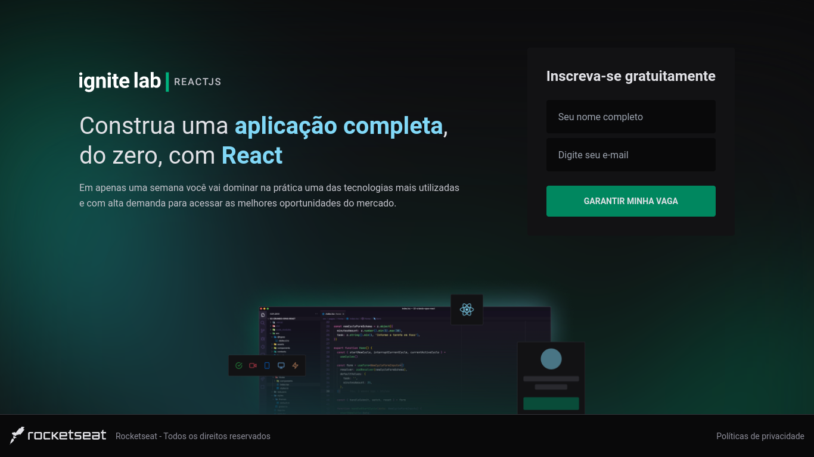
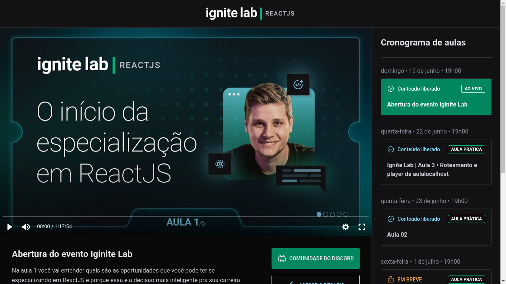
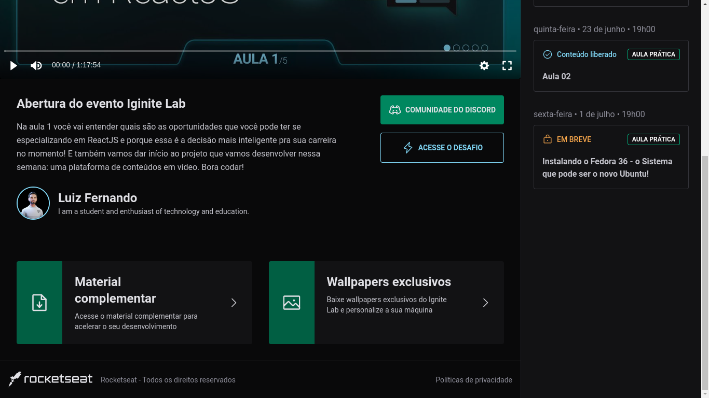

# Ignite Lab React
### Acesse o resultado final: <a href="https://react-lab-ignite.vercel.app">site do React Lab</a>.
---
### Página Inicial do Projeto

### Página de conteúdo

### Página de conteúdo e descrição

## Tecnologias:
- React Vite Typescript
- Tailwind
- GraphQL

---
# Educador: Diego Fernandes
## Participante: Luiz Fernando Alves
